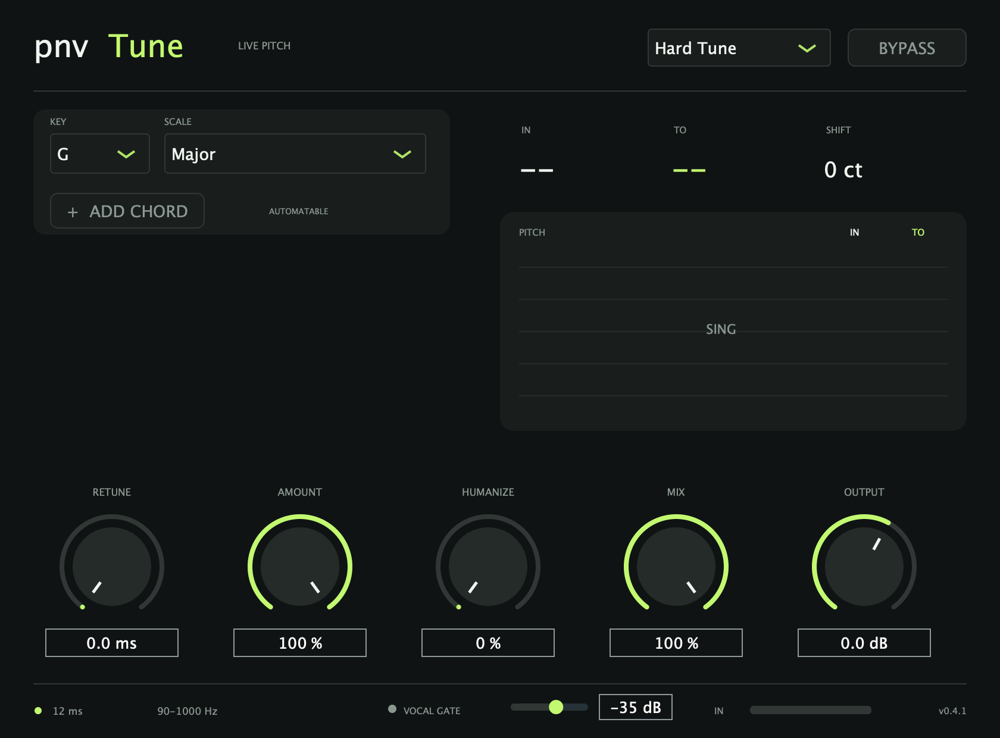

# pnvTune 0.4.1

ปลั๊กอินปรับเสียงร้องแบบเรียลไทม์ สำหรับ Mac Apple Silicon (arm64), macOS 11 ขึ้นไป
มี Audio Unit สำหรับ Logic Pro และ VST3 สำหรับโปรแกรมที่รองรับ



## ใช้ใน Logic Pro

1. ถ้าติดตั้งแล้ว ให้บันทึกงานและเปิด Logic Pro ใหม่
2. ที่แทร็กเสียงร้อง เลือก Audio FX → Audio Units → PNV Audio → pnvTune
3. เลือก Key และ Scale ให้ตรงกับเพลง ถ้ายังไม่ทราบคีย์ เริ่มที่ Chromatic
4. กด **+ ADD CHORD** เมื่อต้องการคอร์ดยืม ปลั๊กอินจะเพิ่มแถวทีละคอร์ด สูงสุด 5 คอร์ด และไม่แสดงแถวที่ยังไม่ได้เพิ่ม
5. ปุ่ม **X** เอาแถวสุดท้ายออกและปิดคอร์ดนั้น จำนวนแถวถูกบันทึกไว้กับโปรเจกต์ แต่ละแถวมีสวิตช์เลข 1–5 ที่ทำ automation แยกกันได้
6. ตัวอย่างเพลง G Major ที่มีคอร์ด E Major: เพิ่มหนึ่งแถว ตั้งเป็น E Major แล้วเปิดเลขของแถวนั้น ระบบจะเพิ่ม G# ให้เป็นโน้ตเป้าหมาย
7. เริ่มด้วย Live Vocal; ใช้ Hard Tune สำหรับเสียงดึงโน้ตชัด ๆ หรือ Natural สำหรับความนุ่มนวล
8. ใช้หูฟังต่อสาย ตั้ง I/O Buffer Size ที่ 32 หรือ 64 samples ตามกำลังเครื่อง
9. ถ้าใช้ Low Latency Monitoring Mode ให้ตั้ง Limit อย่างน้อย 15 ms และตรวจว่าปลั๊กอินไม่ถูก bypass เพราะเอฟเฟกต์อื่นในเส้นทางเสียงอาจเพิ่มความหน่วง
10. ตั้ง **Vocal Gate** โดยหยุดร้องและเล่นกีตาร์ในระดับจริง แล้วเลื่อนขึ้นจนไฟ Gate ไม่ติด จากนั้นร้องคำที่เบาที่สุดและลดค่าลงเล็กน้อยจนไฟติดครบทุกคำ

ถ้าไม่พบปลั๊กอิน เปิด Logic Pro → Settings → Plug-in Manager ค้นหา pnvTune แล้วเลือก Reset & Rescan Selection
โปรดเปิด Logic แบบ native Apple Silicon; ไฟล์ชุดนี้ไม่มี Intel/Rosetta binary

## ปุ่มควบคุม

- **Retune:** 0–200 ms ความเร็วที่ดึงเสียงเข้าโน้ต; 0 คือเร็วสุด ไม่ได้หมายถึง latency เป็นศูนย์
- **Amount:** ความแรงของการแก้โน้ต 0–100%
- **Humanize:** เว้นความคลาดเล็กน้อยรอบโน้ตเป้าหมาย สูงสุด 20 cents เพื่อคงการเคลื่อนไหวของเสียง
- **Mix:** ผสมเสียงแก้โน้ตกับเสียงเดิมที่หน่วงให้ตรงกันโดยประมาณ
- **Output:** ปรับความดัง -18 ถึง +12 dB ไม่มี limiter ในตัว
- **Vocal Gate:** กำหนดระดับต่ำสุดสำหรับตรวจโน้ต (-60 ถึง -18 dB) มีผลเฉพาะตัวตรวจ pitch และไม่ตัดเสียงออกจากแทร็ก
- **Bypass:** ฟังเสียงเดิมผ่าน delay สำหรับการชดเชยเวลา; ไม่ใช่ zero-latency direct monitor

รองรับ Chromatic, Major, Natural Minor, Harmonic Minor และ Major Pentatonic ทั้ง 12 คีย์
ค่าและ automation ถูกเก็บกับโปรเจกต์; factory presets เปลี่ยนเฉพาะปุ่มเสียงและคง Key/Scale เดิม

## ความหน่วงและขอบเขต

ค่าความหน่วงที่รายงานให้ host: 530 samples ที่ 44.1 kHz (12.018 ms), 576 ที่ 48 kHz (12 ms), 1152 ที่ 96 kHz (12 ms)
ทดสอบ impulse แล้วตรงกับค่าเหล่านี้ เสียงที่กำลังถูกเลื่อน pitch ใช้ read heads ที่เคลื่อนที่รอบ delay กลาง 12 ms
ดังนั้น 12 ms เป็นค่า nominal ไม่ใช่เวลาหน่วงคงที่ของเสียงที่ถูกแก้ทุก sample
ช่วงอ่านสูงสุดโดยประมาณ 0.9–23.1 ms ตามโน้ตและตำแหน่ง read head
การตรวจโน้ตใช้หน้าต่างย้อนหลังราว 27–28 ms อัปเดตทุก 4 ms: เสียงเริ่มต้นและโน้ตใหม่อาจต้องรอการจับ pitch เพิ่มเติม
Retune และ hardware/input/output buffers เพิ่มเวลาตอบสนอง ไม่มีคำรับรอง zero latency

เหมาะกับเสียงร้องเดี่ยวสะอาด 90–1000 Hz; สเตอริโอตรวจ pitch จากช่องซ้ายและแก้สองช่องด้วยค่าร่วมกัน
ไม่รองรับคอร์ด เสียงประสานหลายคนพร้อมกัน หรือโน้ตต่ำกว่า 90 Hz
เวอร์ชัน 0.4 ใช้ Vocal Gate กันเสียงรั่วในช่วงหยุดร้อง และยืนยันการกระโดดของโน้ตขนาดใหญ่สามเฟรมเพื่อให้ตัวตรวจตามเสียงร้องเดิมเมื่อกีตาร์โจมตีโน้ตใหม่พร้อมกัน
ทางเดิน pitch ใช้ cubic interpolation และไม่มี Air Preserve ตามผลทดสอบฟังจริงของผู้ใช้
ยังไม่มี formant preservation เต็มรูปแบบ
ถ้ากีตาร์รั่วดังพอ ๆ กับเสียงร้องและอยู่ในช่วงความถี่เดียวกัน ระบบ monophonic แบบเบาไม่สามารถแยกสองแหล่งเสียงได้สมบูรณ์ ควรใช้ไมค์ใกล้ปาก หันด้านรับเสียงต่ำของไมค์เข้าหากีตาร์ และใช้หูฟังแทนลำโพงร่วมด้วย
อาจได้ยินสีเสียงเปลี่ยน/ความเป็นเม็ด/phase ขณะเปลี่ยนโน้ตเร็วหรือผสม dry/wet
เป็นปลั๊กอินพัฒนาขึ้นใหม่ ไม่ใช่ Waves Tune Real-Time

ผลทดสอบอัตโนมัติอยู่ใน docs/Validation.md
แนวทาง latency ของ Logic: https://support.apple.com/en-gb/105040

## ติดตั้งเอง

ไฟล์ AU ติดตั้งที่ `~/Library/Audio/Plug-Ins/Components/PremTune.component`

ไฟล์ VST3 ติดตั้งที่ `~/Library/Audio/Plug-Ins/VST3/PremTune.vst3`

ชื่อไฟล์ภายในยังใช้ PremTune เพื่อให้โปรเจกต์เก่าหาปลั๊กอินเจอ แต่ชื่อที่แสดงใน Logic คือ pnvTune

หรือเปิด `Install pnvTune.command` ในชุดแจกจ่าย ปลั๊กอินเซ็นแบบ ad-hoc สำหรับใช้บนเครื่องนี้ ไม่มี Developer ID notarization
ตัวติดตั้งอัปเดตเฉพาะ pnvTune ไม่แก้ปลั๊กอินอื่น และไม่ล้าง cache ของ Logic

## Build

Requires Apple's Command Line Tools, CMake 3.22+ and JUCE 8.0.9. CMake downloads
JUCE automatically when `vendor/JUCE-8.0.9` is not present.

```sh
cmake -S . -B build -DCMAKE_BUILD_TYPE=Release
cmake --build build -j 6
ctest --test-dir build --output-on-failure
```

The audio callback does not allocate memory, acquire locks, perform file/network I/O,
or launch worker threads. Audio memory is reserved in prepareToPlay. The UI reads atomic meters.
Tests exercise independent output-frequency estimation, scale selection, actual impulse latency,
stereo alignment, silence, state/preset recall and rendering the real plugin editor.

The project includes source under AGPL-3.0-or-later; see LICENSE.md and original dependency notices.
